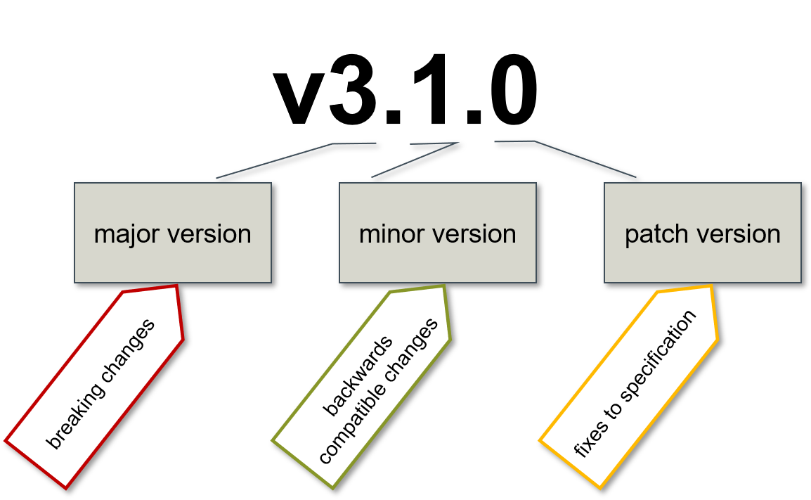
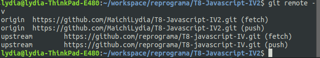

# T8-javascript-IV
Turma 8 | Front-end | 2019 | Semana 13 | Javascript IV

> Nessa semana revisaremos o conteúdo de javascript pré react.

---

### [Aula 1](#aula-1-conteúdo)
#### Resumo
Nessa aula vimos:
* [Git-flow](#git-flow)
* [Array](#array)
* [Try e Catch](#try-e-catch)
* [Exercícios](#exercicios)
* [Conteúdo para estudo](#conteúdo-para-estudo)

### [Aula 2](#aula-2-conteúdo)
#### Resumo
Nessa aula vimos:
* [Object](#object)
* [Exercícios 2](#exercicios-2)

### [Aula 3](#aula-3-conteúdo)
Nessa aula vimos:
* [Callback e promises](callback-e-promises)
* [Async await](async-await)
* [API](api)
* [Fetch](fetch)
* [Exercícios 3](#exercicios-3)

## Aula 1 Conteúdo
#### Git flow
É um dos modelos existentes para organizar branches.
Tendo como principio: 
- Branch master -> Onde temos o código de produção, com a versão mais estável
- Branch develop -> Código em teste, sendo a etapa pré produção, só mandando para a master quando estiver estável.
- Branch feature/funcionalidade -> Criadas a partir da develop, são branches criadas com o objetivo de entregar 'tarefas', como por exemplo uma branch em que você mexe só no menu.
- Branch hotfix -> Branches para correção de bugs críticos
- Branch release -> branch para lançamento de código na master, essas duas costumam gerar tags.


O primeiro número da esquerda para a direita são mudanças grandes que podem pedir que sistemas dependentes se atualizem, sendo a major version, o segundo é a minor, que são modificações que ainda suportam o código antigo e o terceiro é a minor que são correção de bugs

Em aula executamos a criação da develop e fizemos a branch da aula como se fosse uma feature branch, além de solicitar um Pull Request(PR)

```
git clone {repo-novo}
```
Vocês criaram um repositorio no github com a opção de README.md e clonaram. Depois adicionaram um remote desse reposito da reprograma para pegar os arquivos de exercícios:
```
git remote add upstream https://github.com/reprograma/T8-javascript-IV.git
git fetch --all
```
Para vermos se o remote está correto fazemos: 
```
git remote -v
```


Caso queira mudar o repositorio de algum dos remotes é só fazer
```
git remote set-url ${nome dado ao remote} ${url de clone}
```
No nosso caso os valores aceitos para ${nome dado ao remote} são `origin` e `upstream` 

Para criar a develop local e depois mandar para o repositorio online fazemos:
```
git checkout -b develop origin/master
git push origin develop
git branch -a //para listar
```
Para criar a feature branch local e depois mandar para o repositorio online fazemos:
```
git checkout -b aula1 origin/develop
git commit -m "[Aula1] Revisão Array e Object" --allow-empty
git push origin aula1 
```
Para pegar arquivos que estão no repositorio da reprograma:
```
git merge upstream/aula1 --allow-unrelated-histories 
```
E resolver os conflitos.
Durante as aulas fomos atualizando nosso remoto com
```
git add .
git commit -m "${informação sobre o andamento da aula}"
git push origin aula1
```
E ao final fizemos o processo de Pull Request pelo github


#### Array
- Utilizamos como base dois repositorios da Reprograma para essa revisão: 
- [Reprograma T7 - Javascript III por Bruna Vieira](https://github.com/reprograma/T7-JavaScript-III)
- [Reprograma T7 - Javascript IV por Laís Lima](https://github.com/reprograma/t7-javascript-IV/tree/master/aula01-arrays)

**Principais Métodos**
* [**concat**](https://developer.mozilla.org/en-US/docs/Web/JavaScript/Reference/Global_Objects/Array/concat) faz cópia simples do Array e adiciona os argumentos 
* [**join**](https://developer.mozilla.org/en-US/docs/Web/JavaScript/Reference/Global_Objects/Array/join) cria um string do Array. Adiciona o argumento como cola entre cada membro do Array. 
* [**shift**](https://developer.mozilla.org/en-US/docs/Web/JavaScript/Reference/Global_Objects/Array/shift) remove e retorna o primeiro elemento 
* [**pop**](https://developer.mozilla.org/en-US/docs/Web/JavaScript/Reference/Global_Objects/Array/pop) remove e retorna o ultimo elemento 
* [**unshift**](https://developer.mozilla.org/en-US/docs/Web/JavaScript/Reference/Global_Objects/Array/unshift) anexa os argumentos na frente do Array  
* [**push**](https://developer.mozilla.org/en-US/docs/Web/JavaScript/Reference/Global_Objects/Array/push) anexa os argumentos no final do Array  
* [**reverse**](https://developer.mozilla.org/en-US/docs/Web/JavaScript/Reference/Global_Objects/Array/reverse) inverte o Array sem copiá-lo 
* [**slice**](https://developer.mozilla.org/en-US/docs/Web/JavaScript/Reference/Global_Objects/Array/slice) faz cópia simples da porção do Array delimitada por argumentos do índice 
* [**splice**](https://developer.mozilla.org/en-US/docs/Web/JavaScript/Reference/Global_Objects/Array/splice) remove elementos especificados do Array, e os substitui com argumentos adicionais opcionais 
* [**sort**](https://developer.mozilla.org/en-US/docs/Web/JavaScript/Reference/Global_Objects/Array/sort) classifica o Array sem copiá-lo, opcionalmente usando um argumento comparador 
* [**toString**](https://developer.mozilla.org/en-US/docs/Web/JavaScript/Reference/Global_Objects/Array/toString) chama join sem passar um argumento
* [**indexOf**](https://developer.mozilla.org/en-US/docs/Web/JavaScript/Reference/Global_Objects/Array/indexOf) retorna o primeiro elemento igual ao valor especificado, ou -1 *se nenhum for encontrado 
* [**lastIndexOf**](https://developer.mozilla.org/en-US/docs/Web/JavaScript/Reference/Global_Objects/Array/lastIndexOf) retorna o último elemento igual ao valor especificado, ou -1 se nenhum for encontrado 
* [**forEach**](https://developer.mozilla.org/en-US/docs/Web/JavaScript/Reference/Global_Objects/Array/forEach) aplica a função fornecida para todos elementos do Array
* [**map**](https://developer.mozilla.org/en-US/docs/Web/JavaScript/Reference/Global_Objects/Array/map) cria um novo Array contendo os resultados da aplicação da função a todos elementos do Array 
* [**filter**](https://developer.mozilla.org/en-US/docs/Web/JavaScript/Reference/Global_Objects/Array/filter) cria um novo Array contendo todos os elementos para os quais a função fornecida retorna verdadeiro 
* [**reduce**](https://developer.mozilla.org/en-US/docs/Web/JavaScript/Reference/Global_Objects/Array/lastIndexOf) aplica uma função simultaneamente para dois valores do Array (da esquerda para a direita) de forma a reduzi-los a um valor único
* [**some**](https://developer.mozilla.org/en-US/docs/Web/JavaScript/Reference/Global_Objects/Array/some) Checa se pelo menos um dos elementos do array obedece a condição passada pela função
* [**every**](https://developer.mozilla.org/en-US/docs/Web/JavaScript/Reference/Global_Objects/Array/every) Checa se todos os elementos do array obedecem a condição passada pela função 

#### Try e Catch
- [Documentação mozilla sobre try e catch](https://developer.mozilla.org/pt-BR/docs/Web/JavaScript/Reference/Statements/try...catch)
```
try{
    //Aqui vai a tentativa 
}catch(e){
    //Aqui vai o tratamento de quando dá erro.
}
```
Podemos estilizar o erro e lançar exceções utilizando `throw`
```
try{
    if(deuCerto){
        console.log("EBA")
    }else{
        throw "Deu ruim :( a requisição falhou"
    }
}catch(e){  
    console.log(`Tivemos um erro: ${e}`)
}
```
Veja um exemplo de como aplicar no [Exercicio2](array/ex2)

#### Exercicios
- [Exercicio1](array/ex1)
- [Exercicio2](array/ex2)

#### Conteúdo para estudo
- [Documentação mozilla](https://developer.mozilla.org/en-US/docs/Web/JavaScript/Reference/Global_Objects/Array/prototype)
- [Git flow - github](https://datasift.github.io/gitflow/IntroducingGitFlow.html)
- [Git flow - gitlab](https://docs.gitlab.com/ee/workflow/gitlab_flow.html)
- [Git flow - bitbucket](https://br.atlassian.com/git/tutorials/comparing-workflows/gitflow-workflow)

## Aula 2 Conteúdo
#### Object
Nessa aula tivemos:
 - [Revisão](#revisão)
 - [Orientação a objetos](#orientação-a-objetos)
 - [Função construtora e Classes](#função-contrutora-e-classes)
 - [Exercícios](#exercicios-2)

##### Revisão
Podemos obter objetos das seguintes formas: 
```
const object = new Object()
```
Podendo declarar também como
```
object.property = "algum valor"
```
Ou também por notação literal:
```
const object2 = {
    property: 1,
    property2: 'valor'
}
```
**Principais Métodos**
Object.
* [**keys**](https://developer.mozilla.org/pt-BR/docs/Web/JavaScript/Reference/Global_Objects/Object/keys) retorna um array de propriedades enumeraveis de um determinado objeto. 
* [**values**](https://developer.mozilla.org/pt-BR/docs/Web/JavaScript/Reference/Global_Objects/Object/values) retorna um array com os valores das propriedades de um dado objeto
* [**entries**](https://developer.mozilla.org/pt-BR/docs/Web/JavaScript/Reference/Global_Objects/Object/entries) retorna uma array dos próprios pares  [key, value] enumeráveis de um dado objeto
* [**defineProperty**](https://developer.mozilla.org/pt-BR/docs/Web/JavaScript/Reference/Global_Objects/Object/defineProperty) define uma nova propriedade diretamente em um objeto, ou modifica uma propriedade já existente em um objeto, e retorna o objeto
* [**preventExtensions**](https://developer.mozilla.org/pt-BR/docs/Web/JavaScript/Reference/Global_Objects/Object/preventExtensions) impede que novas propriedades sejam adicionadas a um objeto (isto é, impede futuras extensões ao objeto).
* [**seal**](https://developer.mozilla.org/pt-BR/docs/Web/JavaScript/Reference/Global_Objects/Object/seal) sela um Objeto, evitando que novas propriedades sejam adicionadas à ele e marcando todas as propriedades existentes como não configuráveis. Valores das propriedades atuais ainda podem ser alterados desde que essas propriedades sejam graváveis (writable).
* [**freeze**](https://developer.mozilla.org/pt-BR/docs/Web/JavaScript/Reference/Global_Objects/Object/freeze) congela um objeto: isto é, impede que novas propriedades sejam adicionadas a ele; impede que as propriedades existentes sejam removidas; e impede que propriedades existentes, ou sua inumerabilidade, configurabilidade, ou capacidade de escrita sejam alteradas. Em essência o objeto é efetivamente imutável. O método retorna o objeto congelado.

##### Orientação a objetos
- Utilizamos como base dois repositorios da Reprograma para essa revisão: 
- [Reprograma T7 - Javascript III por Bruna Vieira](https://github.com/reprograma/T7-JavaScript-III)
- [Reprograma T7 - Javascript IV por Laís Lima](https://github.com/reprograma/t7-javascript-IV/tree/master/aula02-orientacao-a-objetos)
- Também utilizamos [documentação mozilla](https://developer.mozilla.org/pt-BR/docs/Web/JavaScript/Introduction_to_Object-Oriented_JavaScript)

Javascript é uma linguagem multiparadigma, podendo ser orientada a objeto. Nessa semana passamos pelos principais conceitos:
- Abstração: 
    Formar com que um objeto reflita um modelo da realidade
- Encapsulamento:
    Uma maneira de agrupar os dados e os métodos que usam os dados.
- Herança
    Uma classe pode herdar características de outra classe.
- Polimorfismo
    Diferentes classes podem definir o mesmo método ou propriedade.
- Classe
    Define as características do objeto. Uma classe é uma definição modelo das propriedades e métodos de um objeto.
- Objeto
    Um exemplar de uma classe.
- Atributo
    Uma característica do objeto, como cor, modelo, fabricante se estivemos representando um veículo, por exemplo.
- Método
    Uma ação do objeto, como ligar, desligar, frear se estivemos representando um veículo, por exemplo. É uma subrotina ou função associada a uma classe.

##### Função construtora e Classes
```
function Crianca(nome, idade, altura){
    this.nome = nome
    this.idade = idade
    this.altura = altura
    this.podeBrincar = () => {
        return (altura > 1)
    }
}
```
```
class Crianca{
    constructor(nome, idade, altura){
        this.nome = nome
        this.idade = idade
        this.altura = altura
    }
    podeBrincar() {
        return (this.altura > 1)
    }
}
```
[Função construtora vs classes](https://pt.stackoverflow.com/questions/360919/classes-vs-fun%C3%A7%C3%B5es-construtoras-fun%C3%A7%C3%B5es-f%C3%A1brica)

##### Exercicios 2
- [Exercicio1](objects/ex1)
- [Exercicio2](objects/ex2)
- [Exercicio3](objects/ex3)
- [Exercicio3-componente-geral](objects/ex3-componente-geral)
  > Nesse último exercício vimos como utilizar o componente de forma geral e apenas renderizá-lo chamando pela main, porque aí conseguimos decidir em qual div/tag queremos colocar.

##### Material extra
[slides adicionais da T7-Javascript-IV](https://docs.google.com/presentation/d/1Gkfxzmm3NjleJwvB4yC9k7C_TPa9HloIy0pRO4tLDD0/edit?usp=sharing)

## Aula 3 Conteúdo
#### Callback e promises
Materiais utilizados nesse README.md:
- [slides adicionais da T7-Javascript-IV](https://docs.google.com/presentation/d/1Ni3EtMrCxVRzfrVG4jvau0J7lODHkY3LAIcXyMxKhfo/edit#slide=id.g57adacd656_0_114)
- [JavaScript assíncrono: callbacks, promises e async functions](https://medium.com/@alcidesqueiroz/javascript-ass%C3%ADncrono-callbacks-promises-e-async-functions-9191b8272298)

As frases em `notação assim` são retiradas dos materiais acima, recomendo muito que leiam os materiais indicados.

- Para entendermos o conceito precisamos saber sobre Assíncrono e Síncrono:
    - Síncrono) Eu vou a uma pizzaria, peço uma pizza para viagem no balcão e fico plantado lá, só esperando me entregarem o pedido para que eu possa ir embora. -> *parou completamente até que o pizzaiolo completasse seu trabalho*
    - Assíncrono) Eu vou a uma pizzaria, peço uma pizza para viagem no balcão e, enquanto ela não fica pronta, dou uma passada na livraria ao lado para folhear alguns livros -> *aproveitou o tempo com outras coisas*
##### Callback
- [Documentação Mozilla](https://developer.mozilla.org/pt-BR/docs/Glossario/Callback_function)
Quando queremos fazer alguma ação após o que solicitamos foi terminado podemos utilizar callbacks, um exemplo de utilização comum que vimos em callback é:
```
button.addEventListener("load", function(){
    console.log("Eu sou uma função de callback, prazer!");
});
```
Chamamos a função que mostrará `Eu sou uma função callback`

Callbacks são uteis em vários cenários, porém quando trabalhamos com fluxos muito encadeados, ela acaba ficando muito verbosa e confusa.

Por exemplo: 
```Eu vou a uma pizzaria, peço uma pizza para viagem no balcão e, enquanto ela é preparada, dou uma passada na livraria ao lado. Assim que meu pedido estiver pronto, quero que a balconista me ligue para eu poder retirá-la. Vou levar a pizza para a casa de um amigo, onde o restante da nossa “tchurma” já está esperando para comer. Depois de lá, iremos correndo para um show, pois não queremos ficar muito longe do palco. Na casa do meu amigo, resolvo não comer da pizza, pois já jantei. Fico mexendo no Youtube enquanto eles lancham. Espero eles terminarem, para finalmente irmos para o show. Chegando lá, preciso ligar para outro amigo que também irá, para combinarmos o local onde nos encontraremos.```

O fluxo disso em código ficaria assim:
```
orderPizza(() => {
  console.log(`Minha pizza está pronta.`); 

  waitUntilTheyFinishEating(() => {
    console.log('Acabaram de comer. Vamos para o show.');
    
    goToTheShow(() => {
      console.log('Chegamos');
      
      makeCallToMyFriend(() => {
        console.log('Finalmente acabou. Que comece o show!');
      });
    });
  });
}); 
```
Para que a gente não tivesse um código tão aninhado podemos utilizar `promises`
##### Promises
- [Documentação Mozilla](https://developer.mozilla.org/pt-BR/docs/Web/JavaScript/Reference/Global_Objects/Promise)
As "promessas" representam fluxos assíncronos de forma sequencial além de favorecer o tratamento de excessões

O exemplo de cima ficaria mais ou menos assim:
```
orderPizza()
.then((pizza) => {
  console.log(`Minha pizza de ${pizza.flavor} está pronta.`);

  return waitUntilTheyFinishEating();
})
.then(() => {
  console.log('Acabaram de comer. Vamos para o show.');

  return goToTheShow();
})
.then(() => {
  console.log('Chegamos');

  return makeCallToMyFriend();
})
.then(() => {
  console.log('Finalmente acabou. Que comece o show!');
}).catch(e => console.log('Algo deu ruim :('));
```

Ao final de cada `.then()`
- `Um valor qualquer, como um objeto, array, string, etc: nesse caso, o próximo then da sequência é executado imediatamente, recebendo o valor passado como parâmetro.`
- `Uma outra promessa: foi isso que fizemos no nosso exemplo. Apesar de ainda não termos mostrado como as funções acima criam uma promessa, é óbvio presumirmos que todas essas operações são assíncronas ( orderPizza, waitUntilTheyFinishEating, goToTheShow e makeCallToMyFriend). Para que o próximo then na sequência espere até que uma dessas operações seja concluída, precisamos retornar uma promessa. Uma vez que a promessa for satisfeita, o fluxo segue.`

Utilizamos o `.catch()` para tratar exceções 

Como criar promises:
```
const myFirstPromise = new Promise((resolve, reject) => {
  // do something asynchronous which eventually calls either:
  resolve(someValue); // fulfilled
  // or
  reject("failure reason"); // rejected
});

OU 

pizzaFlow()
.then(() => console.log('O show acabou!'));
.catch(erro => console.log('Ops!' + erro));
```
Sobre o resolve: `A função resolve deve ser chamada para sinalizar que a promessa foi cumprida, ou “resolvida”. Caso a operação assíncrona que estava sendo executada possua algum retorno (por exemplo: uma lista de usuários), você o passa como argumento para a função resolve. Quando a promessa é resolvida, o primeiro then da cadeia é chamado.`

Sobre reject: `Em caso de alguma falha, como por exemplo a indisponibilidade de um endpoint, a função reject deve ser chamada. Ao executá-la, você estará sinalizando que a promessa falhou e você vai dar aquele “calote gostoso” em quem dependia do seu retorno.`

#### Async Await
- [Documentação Mozilla](https://developer.mozilla.org/pt-BR/docs/Web/JavaScript/Reference/Statements/funcoes_assincronas)
`As async functions fazem código assíncrono parecer síncrono.`
O exemplo que utilizamos antes ficaria assim: 
```
async function pizzaFlow() {
  let pizza = await orderPizza();
  console.log(`Minha pizza de ${pizza.flavor} está pronta.`);

  await waitUntilTheyFinishEating();
  console.log('Acabaram de comer. Vamos para o show.');

  await goToTheShow();
  console.log('Chegamos');

  await makeCallToMyFriend();
  console.log('Finalmente acabou. Que comece o show!');
}
```
` O que a função orderPizza e as outras três invocadas com await retornam? Promises, baby. Async functions são altamente integráveis com promessas. Tanto, que até retornam promessas:`
```
pizzaFlow().then(() => console.log('O show acabou!'));
//=> Minha pizza de bacon está pronta.
//=> Acabaram de comer. Vamos para o show.
//=> Chegamos
//=> Finalmente acabou. Que comece o show!
//=> O show acabou!
```

A estrutura de uma função async é

```
async function nomedaFunc(){
    await algumaFuncDeclaradaAntes()
    // ou também em atribuição
    let resultadoEsperando = await retornaResultadoFunc()
}
```
Ou em arrow:
```
let nomeDaFunc = async() => {
    await algumaFuncDeclaradaAntes()
    // ou também em atribuição
    let resultadoEsperando = await retornaResultadoFunc()
}
```
`Ao encontrar uma declaração await, a instrução seguinte não será executada até que a promessa em andamento seja resolvida. Isso é possível graças à magia dos generators, outro importante recurso do ES2015.`

#### API
Materiais utilizados nesse README.md:
- [slides adicionais da T7-Javascript-IV API](https://docs.google.com/presentation/d/1dtiJKya7TJaIsGu26OAUxAjkD6PLl8-3-Gzx0yT7Tw0/edit#slide=id.p)
- [http](https://docs.google.com/presentation/d/1PmEigFefcOp0L-MW50nZr0hWhoJmb6RJcqS_NERhhAg/edit#slide=id.g5a98031ff9_0_184)
- [Vídeo API garçom](https://www.youtube.com/watch?v=s7wmiS2mSXY)
- [Material](https://mundoapi.com.br/materias/para-entender-o-que-e-api-o-garcom/)
- [Beginners Guide To Fetching Data With (AJAX, Fetch API & Async/Await)](https://dev.to/bjhaid_93/beginners-guide-to-fetching-data-with-ajax-fetch-api--asyncawait-3m1l )

- Métodos de API e HTTP Status Code:

Método | O que faz        | Status de retorno |
-------|------------------|-------------------|
GET    | Traz informações | 200               |
POST   | Cria um novo item| 201               |
PUT    | Atualiza um item | 200               |
DELETE | Remove um item   | 200               |

Podemos encontrar mais sobre http status code [aqui](https://developer.mozilla.org/pt-BR/docs/Web/HTTP/Status)


#### Fetch
Materiais utilizados nesse README.md:
- [slides adicionais da T7-Javascript-IV fetch](https://docs.google.com/presentation/d/1_eaIDf3Iqop-RSuTeE8sLmooiIhKNV4L8ThHDYDCuG0/edit?usp=sharing)
- [Documentação mozilla](https://developer.mozilla.org/pt-BR/docs/Web/API/Fetch_API/Using_Fetch)

É uma performance declarativa de requisição HTTP que cria uma promise que resolve a resposta da request para mostrar o que ocorreu com sucesso ou não.
Assim como fazemos com as promises, acessamos esse valor a partir do .then()

```
fetch('https://example.com/todos')
  .then(response => response.json())
  .then(data => console.log(JSON.stringify(data)))
```

Utilizando POST
```
fetch('https://example.com/users', {
  headers: { "Content-Type": "application/json; charset=utf-8" },
  method: 'POST',
  body: JSON.stringify({
    username: 'Elon Musk',
    email: 'elonmusk@gmail.com',
  })
})
```

Utilizando DELETE
```
fetch('https://example.com/users/1', { 
  method: 'DELETE' 
})
```
#### Exercicios 3
- [exPromiseJS3](promises/exPromiseJS3)
- [ArcoIro](fetch/ex-async-await-promise-fetch)
- [Tarot](fetch/ex01)
- [ViaCep](fetch/ex02)
- [Post](fetch/ex03)
