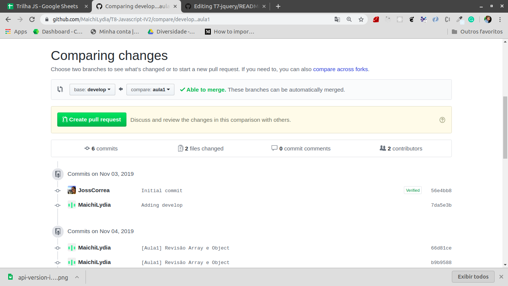

## Exercício git finalizando Aula 2
- Mande todas as suas atualizações para a branch da aula2 criada no seu repositorio
  - git add .
  - git commit -m "${sua mensagem}"
  - git push origin ${sua branch}
- Pegue todas as atualizações do remote:
 - git fetch --all
- Caso queira pegar alguma atualização do repositório da reprograma faça isso **apenas depois de ter dado push da sua branch pro seu repositorio**:
 - git merge upstream/aula2
 - Resolva os conflitos
 - git add .
 - git commit
 - git push -f origin aula2
- Abra um Pull request da aula2 para a develop
 
 Nessa imagem temos um exemplo de quando abrimos da aula1.
 - Dê o Merge
 - **Não apague a branch aula2** 
- Após esse processo vamos criar a branch da aula3:
 - git fetch --all
 - git checkout -b aula3 origin/develop
 - git commit -m "[Aula3] Promises, API, fetch POST" --allow-empty
 - git push origin aula3
#### E pronto :) !
- É possível que nesse processo apareçam conflitos, e nós já passamos por eles ! Por isso é importante manter a branch do nosso repositorio atualizada para que a gente não perca nada e tenha como comparar nossas modificações :) 
